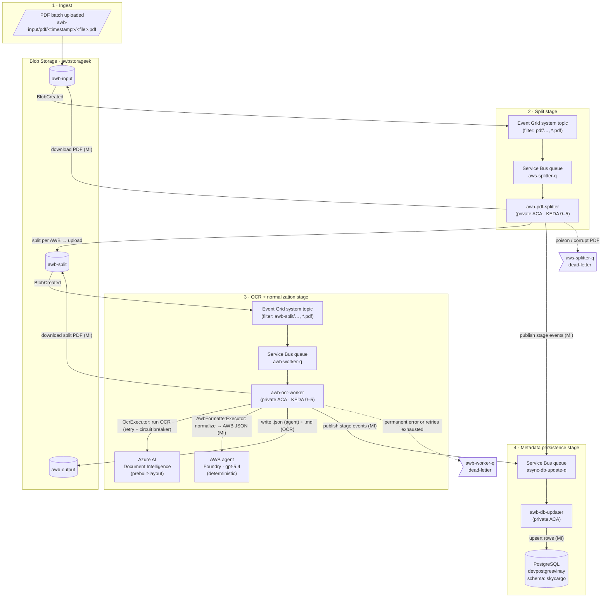
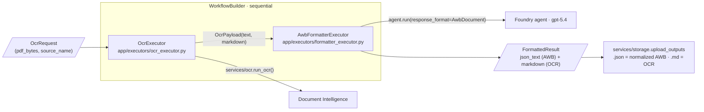
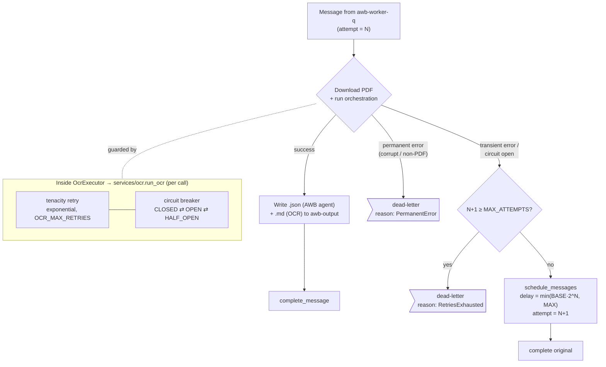
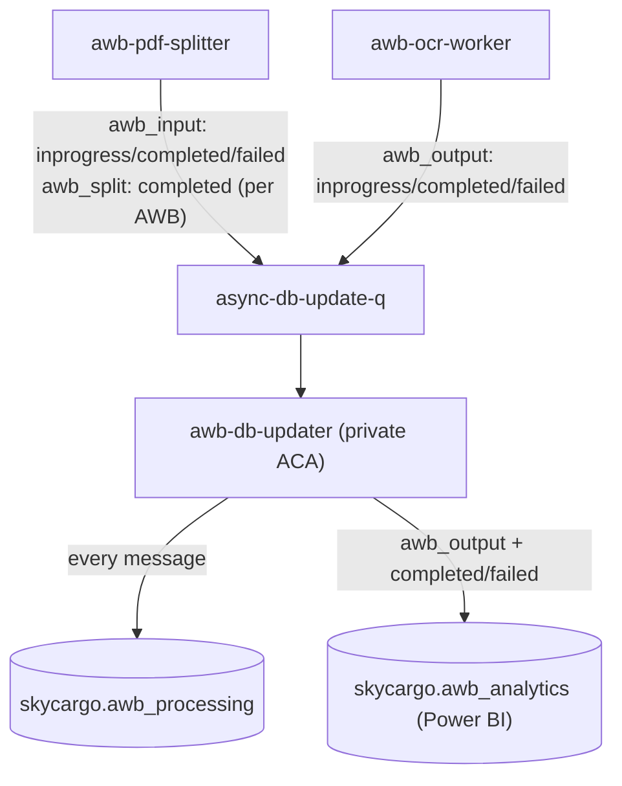
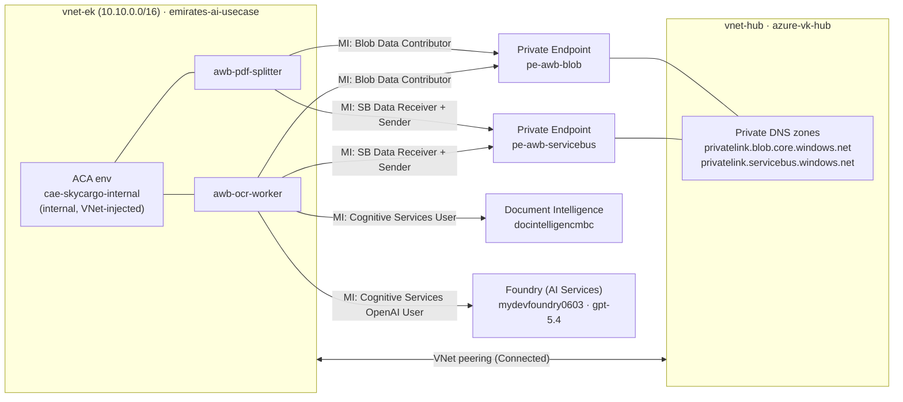

# SkyCargo AWB Processing — End-to-End Workflow

Private, event-driven pipeline that ingests multi-AWB PDF batches, splits them
into individual Air Waybills, runs OCR, normalizes the result with a Microsoft
Agent Framework workflow, stores structured output, and persists per-stage
metadata to PostgreSQL — all over private networking with managed-identity
(keyless) auth.

## Pipeline overview



## OCR worker — sequential agent orchestration

Inside the worker, each message runs a Microsoft Agent Framework workflow that
chains two executors with a single sequential edge. The agent is configured for
deterministic output (low temperature + fixed seed + structured output), so the
same OCR text always yields identical normalized JSON.



## OCR worker reliability (retry → backoff → dead-letter)



## Metadata persistence (async DB updates)

The splitter and the OCR worker **publish stage/state events** to the
`async-db-update-q` Service Bus queue (keyless, managed identity) at each
lifecycle transition. The dedicated `awb-db-updater` worker consumes that queue
and upserts rows into the `skycargo` PostgreSQL schema — decoupling the
processing path from the database so a DB hiccup never blocks OCR or splitting.



- A stable `docId` (`pdf/<timestamp>`, derived from the source blob path) is
  shared by both producers so split/output rows link back to their `awb_input`
  parent via `parent_id`.
- Publishing is **best-effort**: a publish failure is logged but never breaks
  the pipeline.
- See [`awb-db-updater/README.md`](awb-db-updater/README.md) for the full
  message contract and schema.

## Networking & identity



## Key components

| Component | Resource | Notes |
|-----------|----------|-------|
| Input container | `awbstorageek/awb-input` | Watched by Event Grid (prefix `pdf/`). |
| Split container | `awbstorageek/awb-split` | Split outputs; watched → `awb-worker-q`. Separate container breaks recursion. |
| Output container | `awbstorageek/awb-output` | Normalized AWB `.json` (agent) + OCR `.md`; not watched. |
| Splitter queue | `awb-sb-ek/aws-splitter-q` | Drives `awb-pdf-splitter`. |
| Worker queue | `awb-sb-ek/awb-worker-q` | Drives `awb-ocr-worker`. |
| DB-update queue | `awb-sb-ek/async-db-update-q` | Stage/state events from splitter + worker; drives `awb-db-updater`. |
| Splitter app | `awb-pdf-splitter` (ACA) | Internal ingress, KEDA on `aws-splitter-q`. |
| OCR app | `awb-ocr-worker` (ACA) | Internal ingress, KEDA on `awb-worker-q`. |
| DB updater app | `awb-db-updater` (ACA) | Consumes `async-db-update-q`, upserts `skycargo` schema. |
| OCR backend | `docintelligencmbc` | Document Intelligence `prebuilt-layout`. |
| AWB agent model | `mydevfoundry0603` | Foundry `gpt-5.4`; deterministic normalization. |
| Metadata store | `devpostgresvinay` | PostgreSQL flexible server, schema `skycargo` (`awb_processing`, `awb_analytics`). |
| ACA environment | `cae-skycargo-internal` | VNet-injected into `vnet-ek`, internal only. |

All cross-service calls use **system-assigned managed identities** (no keys or
connection strings) and travel over **private endpoints** resolved through the
hub VNet's Private DNS zones.

## OCR worker code structure

The worker is a production-grade Python package (`app/`) with clear separation
between services, executors, and orchestration:

```
awb-ocr-worker/
  Dockerfile                      # non-root, healthcheck, runs app.main:app
  requirements.txt
  app/
    main.py                       # FastAPI health API; starts the consumer
    consumer.py                   # Service Bus loop: retry → backoff → dead-letter
    core/
      circuit_breaker.py          # thread-safe CLOSED/OPEN/HALF_OPEN breaker
    services/
      ocr.py                      # Document Intelligence (retry + breaker)
      storage.py                  # Blob download + upload_outputs(.json/.md)
      db_events.py                # publish awb_output events to async-db-update-q
    executors/
      ocr_executor.py             # OcrExecutor: PDF → OCR text + markdown
      formatter_executor.py       # AwbFormatterExecutor: text → normalized JSON
    orchestration/
      orchestrator.py             # sequential WorkflowBuilder wiring + run_orchestration
      agent.py                    # Foundry chat agent factory + instructions
      schema.py                   # AwbDocument / Party / RoutingLeg pydantic models
      messages.py                 # OcrRequest / OcrPayload / FormattedResult
```
